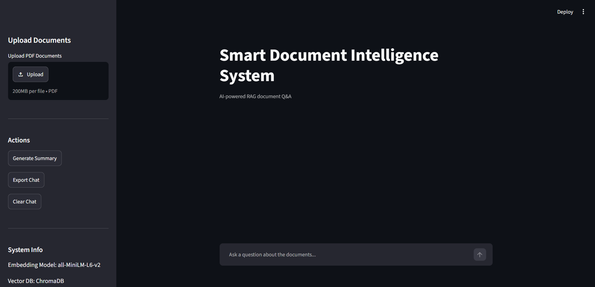
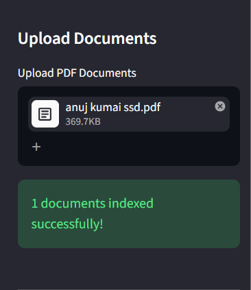
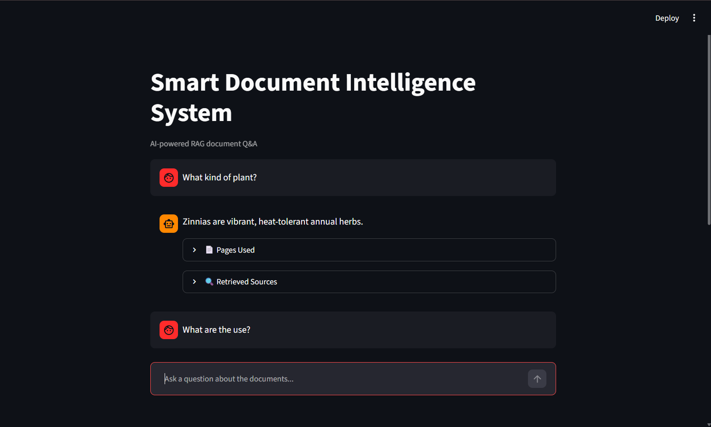
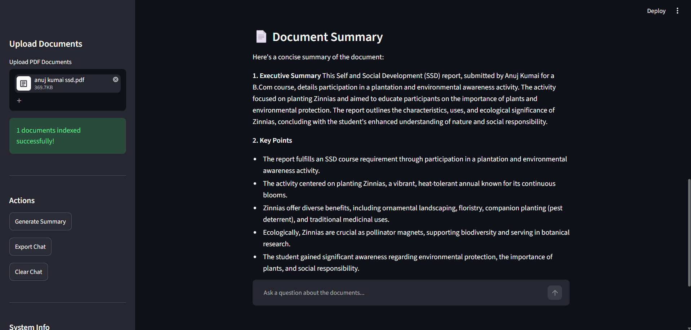

# 📄 Smart Document Intelligence System

## 🌐 Live Demo

🚀 **Application:** *(Coming Soon)*

```
https://smartdocintelligence.streamlit.app/
```

💻 **GitHub Repository**

```
https://github.com/tanujkumai/smart_doc_intelligence
```

---

> AI-powered document question answering using **Retrieval-Augmented Generation (RAG)**, **Google Gemini**, **LangChain**, **ChromaDB**, and **Streamlit**.


---

## 📖 Overview

Smart Document Intelligence System is an AI-powered application that enables users to upload PDF documents, ask natural language questions, generate document summaries, and export conversations into Microsoft Word reports.

Instead of searching through lengthy documents manually, users can interact with their documents using conversational AI. The system retrieves the most relevant document sections using semantic search and provides context-aware responses generated by Google's Gemini Large Language Model (LLM).

This project was developed as the **Major Project** for the **Master of Computer Applications (MCA)** program.

---

## ✨ Features

- 📄 Upload one or multiple PDF documents
- 🔍 Automatic PDF text extraction
- ✂ Intelligent document chunking
- 🧠 Semantic embeddings using Sentence Transformers
- 📚 Vector storage using ChromaDB
- 🤖 AI-powered Question Answering using Google Gemini
- 📝 Document summarization
- 📄 Export conversations to Microsoft Word (.docx)
- 📑 Display source pages used to generate answers
- ⚡ Fast semantic similarity search
- 🧪 Automated testing using pytest
- 📊 Code coverage analysis using pytest-cov
- 🎨 Simple and responsive Streamlit interface

---

## Home Page



---

## Upload PDF



---

## Question Answering



---

## Document Summary



---

# Demo Workflow

```text
        Upload PDF
             │
             ▼
    Text Extraction
             │
             ▼
      Document Chunking
             │
             ▼
 Sentence Transformer Embeddings
             │
             ▼
        ChromaDB Storage
             │
             ▼
       User asks Question
             │
             ▼
     Similarity Search (Top-K)
             │
             ▼
      Gemini 2.5 Flash LLM
             │
             ▼
      Context-aware Answer
```

---

# Technology Stack

| Category | Technology |
|-----------|------------|
| Programming Language | Python |
| User Interface | Streamlit |
| LLM | Google Gemini 2.5 Flash |
| Framework | LangChain |
| Vector Database | ChromaDB |
| Embedding Model | sentence-transformers/all-MiniLM-L6-v2 |
| PDF Processing | PyMuPDF |
| Text Chunking | RecursiveCharacterTextSplitter |
| Report Generation | python-docx |
| Testing | pytest |
| Code Coverage | pytest-cov |

---

# Project Structure

```text
smart_doc_intelligence/
│
├── app.py
├── requirements.txt
├── README.md
├── pytest.ini
├── .gitignore
├── .env.example
│
├── src/
│   ├── pdf_processor.py
│   ├── vector_store.py
│   ├── rag_chain.py
│   ├── summarizer.py
│   ├── report_generator.py
│   └── __init__.py
│
├── data/
│   ├── uploads/
│   └── chroma_db/
│
├── reports/
│   └── generated_reports/
│
├── docs/
│   ├── architecture.png
│   ├── dfd.png
│   ├── use_case_diagram.png
│   └── screenshots/
│
└── tests/
    ├── sample_docs/
    ├── screenshots/
    ├── test_pdf_processor.py
    ├── test_vector_store.py
    ├── test_rag_chain.py
    ├── test_report_generator.py
    ├── test_summarizer.py
    └── test_cases.md
```

---
# 🚀 Installation

## 1. Clone the Repository

```bash
git clone https://github.com/<your-github-username>/smart_doc_intelligence.git

cd smart_doc_intelligence
```

---

## 2. Create a Virtual Environment

### Using Conda (Recommended)

```bash
conda create -n smart-doc python=3.11

conda activate smart-doc
```

### Or Using venv

```bash
python -m venv venv

# Windows
venv\Scripts\activate

# Linux/macOS
source venv/bin/activate
```

---

## 3. Install Dependencies

```bash
pip install -r requirements.txt
```

---

## 4. Configure Environment Variables

Create a `.env` file in the project root.

```text
GOOGLE_API_KEY=YOUR_GEMINI_API_KEY
```

> **Note:** Never commit your `.env` file. Use `.env.example` as a template.

---

## 5. Run the Application

```bash
streamlit run app.py
```

The application will automatically open in your browser.

Usually at:

```
http://localhost:8501
```

---

# 💡 How to Use

## Step 1

Launch the application.

---

## Step 2

Upload one or more PDF documents.

The system automatically:

- extracts text
- cleans the content
- splits it into chunks
- generates embeddings
- stores vectors in ChromaDB

---

## Step 3

Ask questions in natural language.

Example:

```
What are the main objectives of this document?

Summarize Chapter 3.

Who is the author?

What conclusions are presented?
```

The application retrieves the most relevant document chunks before sending them to the Gemini LLM.

---

## Step 4

View Source Pages

Every answer displays:

- Source document
- Page number(s)
- Retrieved text chunks

This makes the generated responses transparent and verifiable.

---

## Step 5

Generate Summary

Click:

```
Generate Summary
```

The application creates a structured summary including:

- Executive Summary
- Key Points
- Important Findings

---

## Step 6

Export Chat

Click:

```
Export Chat
```

A Microsoft Word report is automatically generated.

Location:

```
reports/generated_reports/chat_report.docx
```

---

# ⚙️ How the System Works

The application follows a Retrieval-Augmented Generation (RAG) pipeline.

```
User Uploads PDF
        │
        ▼
PDF Text Extraction
        │
        ▼
Text Cleaning
        │
        ▼
Chunk Generation
        │
        ▼
Sentence Transformer Embeddings
        │
        ▼
ChromaDB Vector Database
        │
        ▼
User Question
        │
        ▼
Semantic Similarity Search
        │
        ▼
Relevant Chunks Retrieved
        │
        ▼
Google Gemini 2.5 Flash
        │
        ▼
Context-Aware Response
```

---

# 📂 Core Modules

## pdf_processor.py

Responsible for:

- PDF text extraction
- Text cleaning
- Document chunking

---

## vector_store.py

Responsible for:

- Embedding generation
- ChromaDB initialization
- Similarity search
- Vector storage

---

## rag_chain.py

Responsible for:

- Prompt construction
- Context retrieval
- Gemini interaction
- Response generation

---

## summarizer.py

Generates structured summaries for uploaded documents.

---

## report_generator.py

Creates Microsoft Word reports from the chat history.

---
# 🧪 Testing

The project includes both **automated testing** using `pytest` and **manual system testing** to verify the application's functionality.

## Automated Tests

The following modules are covered by automated tests:

- PDF Processing
- Vector Store
- RAG Pipeline
- Document Summarization
- Report Generation

Run all tests using:

```bash
pytest
```

Run tests with code coverage:

```bash
pytest --cov=src --cov-report=term-missing
```

Example output:

```text
8 passed in 39.46s

Coverage Report

TOTAL    83%
```

---

## Manual Testing

The application was also tested manually using various functional and edge-case scenarios.

| Test Case | Description | Status |
|-----------|-------------|--------|
| TC-001 | Upload Single PDF | ✅ Pass |
| TC-002 | Upload Multiple PDFs | ✅ Pass |
| TC-003 | Ask Question | ✅ Pass |
| TC-004 | Question Not Present | ✅ Pass |
| TC-005 | Generate Summary | ✅ Pass |
| TC-006 | Export Chat Report | ✅ Pass |
| TC-007 | Clear Chat | ✅ Pass |
| TC-008 | Source Pages Verification | ✅ Pass |
| TC-009 | Large PDF Processing | ✅ Pass |
| TC-010 | Empty PDF Handling | ✅ Pass |
| TC-011 | Invalid File Upload | ✅ Pass |
| TC-012 | Restart & Re-upload | ✅ Pass |

---

# 📷 Application Screenshots

## Home Page

```
docs/screenshots/home.png
```

---

## Upload Documents

```
docs/screenshots/upload.png
```

---

## AI Question Answering

```
docs/screenshots/question_answer.png
```

---

## Document Summary

```
docs/screenshots/summary.png
```

---

## Export Chat

```
docs/screenshots/export_chat.png
```

---

## Source Pages

```
docs/screenshots/source_pages.png
```

> Replace the placeholder paths above with actual screenshots from your project.

---

# 📊 Project Statistics

| Metric | Value |
|----------|-------|
| Programming Language | Python |
| Architecture | Retrieval-Augmented Generation (RAG) |
| Vector Database | ChromaDB |
| LLM | Google Gemini 2.5 Flash |
| Testing Framework | pytest |
| Automated Tests | 8 |
| Manual Test Cases | 12 |
| Code Coverage | 83% |
| Report Export | Microsoft Word (.docx) |
| User Interface | Streamlit |

---

# 📈 Project Highlights

- ✅ Retrieval-Augmented Generation (RAG)
- ✅ Google Gemini Integration
- ✅ Semantic Search
- ✅ ChromaDB Vector Database
- ✅ Multiple PDF Support
- ✅ Context-Aware Question Answering
- ✅ Document Summarization
- ✅ Word Report Generation
- ✅ Automated Testing
- ✅ Code Coverage Analysis
- ✅ Clean Modular Architecture

---

# 🚀 Future Enhancements

The following features can be added in future versions:

- Support for Microsoft Word (.docx) documents
- Support for PowerPoint (.pptx) files
- Optical Character Recognition (OCR) for scanned PDFs
- User authentication and login
- Chat history persistence using a database
- Multi-user support
- Cloud deployment
- REST API using FastAPI
- Citation confidence scores
- Hybrid search (Keyword + Semantic Search)
- Multilingual document support
- Audio question answering
- Docker containerization
- Kubernetes deployment
- Document comparison feature

---

# 📚 Learning Outcomes

This project provided practical experience with:

- Retrieval-Augmented Generation (RAG)
- Large Language Models (LLMs)
- Prompt Engineering
- Semantic Search
- Vector Databases
- LangChain Framework
- Google Gemini API
- Streamlit Application Development
- Software Testing using pytest
- Code Coverage Analysis
- Modular Python Development
- Git and GitHub

---

# 🤝 Contributing

Contributions, suggestions, and improvements are welcome.

If you would like to contribute:

1. Fork the repository
2. Create a feature branch

```bash
git checkout -b feature/new-feature
```

3. Commit your changes

```bash
git commit -m "Add new feature"
```

4. Push the branch

```bash
git push origin feature/new-feature
```

5. Open a Pull Request

---

# 📄 License

This project is licensed under the **MIT License**.

Feel free to use, modify, and distribute this project in accordance with the license terms.

---

# 👨‍💻 Author

**Tanuj Kumai**

Master of Computer Applications (MCA)

Specialization: Artificial Intelligence & Machine Learning

GitHub:

```
https://github.com/tanujkumai
```

LinkedIn:

```
https://linkedin.com/in/tanujkumai
```

---

# 🙏 Acknowledgements

This project was built using the following open-source technologies and services:

- Python
- Streamlit
- LangChain
- Google Gemini
- ChromaDB
- Sentence Transformers
- Hugging Face
- PyMuPDF
- python-docx
- pytest

Special thanks to the open-source community for providing excellent tools and documentation that made this project possible.