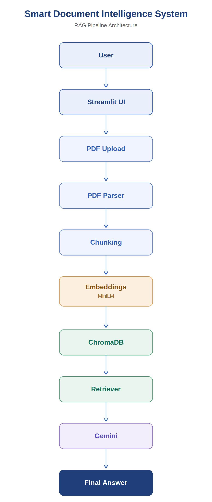

# 📄 Smart Document Intelligence System Using Retrieval-Augmented Generation (RAG)

<p align="center">
  
</p>

<p align="center">


</p>

An AI-powered **Document Question Answering System** that enables users to upload one or multiple PDF documents and interact with them using natural language.

The application leverages **Retrieval-Augmented Generation (RAG)**, combining **semantic search** with **Google Gemini 2.5 Flash** to generate accurate, context-aware answers grounded in the uploaded documents.

Unlike traditional keyword-based search systems, this project understands the semantic meaning of user queries using vector embeddings, making document search faster, smarter, and more reliable.

> 🎓 Developed as part of the **Master of Computer Applications (MCA) Major Project**.

---

# 📑 Table of Contents

- Features
- Project Preview
- Problem Statement
- Objectives
- System Architecture
- RAG Workflow
- Technology Stack
- Why These Technologies?
- Project Structure
- Installation
- Demo Video
- Live Demo
- Workflow
- Testing
- Limitations
- Future Enhancements
- Applications
- Expected Outcomes
- Acknowledgements
- License
- Author

---

# ✨ Features

- 📖 Automatic PDF text extraction
- ✂️ Intelligent text chunking with overlap
- 🧠 Semantic search using vector embeddings
- 🤖 AI-powered question answering using Gemini 2.5 Flash
- 📄 Source page attribution
- 💬 Interactive chat interface
- 📝 Automatic document summarization
- 📤 Export chat history as DOCX report
- ⚡ Fast retrieval using ChromaDB

---

# 📸 Project Preview

## 🏠 Home Page

<p align="center">

</p>

The landing page allows users to upload one or multiple PDF documents and interact with the AI assistant through an intuitive chat interface.

---

## 📂 Uploading PDF Documents

<p align="center">

</p>

After uploading PDFs, the application extracts document text, generates semantic embeddings, and indexes them into **ChromaDB** for efficient retrieval.

---

## 💬 Ask Questions

<p align="center">

</p>

Users can ask natural language questions about uploaded documents. The system retrieves the most relevant document chunks and generates grounded responses using **Gemini 2.5 Flash**.

---

## 📝 Document Summary

<p align="center">

</p>

Generate concise summaries of uploaded documents to quickly understand their content without reading the complete document.

---

# 📌 Problem Statement

Searching lengthy documents manually is time-consuming and inefficient.

Traditional search engines rely heavily on exact keyword matching and often fail to understand the semantic meaning behind user queries.

The objective of this project is to build an intelligent document analysis system capable of:

- Processing uploaded PDF documents
- Understanding document content semantically
- Retrieving relevant information efficiently
- Generating context-aware answers
- Providing document summaries
- Displaying source page references

---

# 🎯 Objectives

- Develop an intelligent document retrieval system using Retrieval-Augmented Generation (RAG).
- Enable natural language interaction with uploaded documents.
- Implement semantic search using vector embeddings.
- Generate context-aware responses using Gemini.
- Provide automatic document summarization.
- Improve search efficiency compared to keyword-based systems.

---

# 🏗️ System Architecture

<p align="center">

</p>

```text
                    User
                      │
                      ▼
            Streamlit Web Interface
                      │
                      ▼
              PDF Upload Module
                      │
                      ▼
             PDF Text Extraction
                  (PyMuPDF)
                      │
                      ▼
           Intelligent Text Chunking
                      │
                      ▼
     Sentence Transformer Embeddings
        (all-MiniLM-L6-v2)
                      │
                      ▼
            ChromaDB Vector Store
                      │
                      ▼
          Similarity Search Retriever
                      │
                      ▼
            Gemini 2.5 Flash LLM
                      │
                      ▼
     Context-Aware Answer Generation
                      │
                      ▼
         Answer + Source References
```

---

# 🔄 Retrieval-Augmented Generation (RAG) Workflow

```text
Upload PDF
      │
      ▼
Extract Text
      │
      ▼
Split into Chunks
      │
      ▼
Generate Embeddings
      │
      ▼
Store in ChromaDB
      │
      ▼
User Asks Question
      │
      ▼
Retrieve Relevant Chunks
      │
      ▼
Gemini 2.5 Flash
      │
      ▼
Grounded Response
```

## How It Works

1. Upload one or multiple PDF documents.
2. Extract text from each page.
3. Split text into overlapping chunks.
4. Generate semantic embeddings.
5. Store embeddings in ChromaDB.
6. Convert user query into embeddings.
7. Retrieve relevant document chunks.
8. Pass retrieved context to Gemini.
9. Generate a grounded answer.
10. Display source page references.

---

# 🛠 Technology Stack

| Component | Technology |
|------------|------------|
| Frontend | Streamlit |
| Backend | Python |
| LLM | Gemini 2.5 Flash |
| AI Framework | LangChain |
| Embeddings | Sentence Transformers |
| Embedding Model | all-MiniLM-L6-v2 |
| Vector Database | ChromaDB |
| PDF Processing | PyMuPDF, PyPDF |
| Data Handling | NumPy, Pandas |
| Reports | python-docx |
| Testing | Pytest |

---

# 💡 Why These Technologies?

| Technology | Purpose |
|------------|----------|
| Python | AI ecosystem |
| Streamlit | Rapid web app development |
| LangChain | RAG pipeline orchestration |
| Gemini 2.5 Flash | Fast LLM inference |
| ChromaDB | Vector similarity search |
| Sentence Transformers | Semantic embeddings |
| PyMuPDF | Accurate PDF parsing |
| python-docx | Export chat reports |
| Pytest | Unit testing |

---

# 📂 Project Structure

```text
smart-doc-intelligence/
│
├── app.py
├── requirements.txt
├── README.md
├── .env
│
├── src/
│   ├── pdf_processor.py
│   ├── embeddings.py
│   ├── vector_store.py
│   ├── rag_chain.py
│   ├── summarizer.py
│   ├── report_generator.py
│   └── database.py
│
├── docs/
│   ├── architecture.png
│   ├── dfd.png
│   ├── use_case_diagram.png
│   └── screenshots/
│       ├── home_page.png
│       ├── upload_success.png
│       ├── qa_example.png
│       └── summary.png
│
├── data/
│   ├── uploads/
│   └── chroma_db/
│
├── reports/
│
└── tests/
```

---

# 🚀 Installation

## Clone Repository

```bash
git clone https://github.com/your-username/smart-doc-intelligence.git

cd smart-doc-intelligence
```

## Create Environment

```bash
conda create -n smart-rag python=3.11

conda activate smart-rag
```

## Install Dependencies

```bash
pip install -r requirements.txt
```

## Configure Environment

Create `.env`

```env
GOOGLE_API_KEY=YOUR_API_KEY
```

## Run Application

```bash
streamlit run app.py
```

---

# 🎥 Demo Video

A complete walkthrough of the application is available below.

> 📹 **Watch the Demo:**  
> https://youtu.be/YOUR_VIDEO_LINK

Or, if you haven't uploaded the video yet:

> **Coming Soon**

---

# 🌐 Live Demo

Try the application online:

**Live Application**

https://your-app-url.streamlit.app

> **Coming Soon** (Update after deployment)

---

# 📊 Application Workflow

The overall workflow of the application is illustrated below.

```text
                Upload PDF Documents
                         │
                         ▼
                Extract Text (PyMuPDF)
                         │
                         ▼
              Split into Text Chunks
                         │
                         ▼
          Generate Vector Embeddings
                         │
                         ▼
          Store Embeddings in ChromaDB
                         │
                         ▼
              User Asks a Question
                         │
                         ▼
      Retrieve Relevant Document Chunks
                         │
                         ▼
         Generate Response using Gemini
                         │
                         ▼
      Display Answer with Source Pages
```

### Workflow Steps

1. Upload one or more PDF documents.
2. Extract text while preserving page metadata.
3. Split extracted text into overlapping chunks.
4. Generate semantic embeddings using Sentence Transformers.
5. Store embeddings in ChromaDB.
6. User asks a natural language question.
7. Retrieve the most relevant chunks.
8. Send retrieved context to Gemini 2.5 Flash.
9. Generate a grounded answer.
10. Display the response along with source page references.

---

# 🧪 Testing

The project includes unit tests for the core modules.

### Covered Modules

- ✅ PDF text extraction
- ✅ Text chunking
- ✅ Embedding generation
- ✅ ChromaDB retrieval
- ✅ RAG pipeline
- ✅ Gemini response generation
- ✅ Report generation

Run all tests:

```bash
pytest
```

Run with coverage:

```bash
pytest --cov=src
```

---

# 📸 More Screenshots

## 🤖 AI Question Answering

<p align="center">

</p>

The chatbot retrieves the most relevant document sections and answers user questions with page references for transparency.

---

## 📝 Automatic Document Summary

<p align="center">

</p>

Generate concise summaries to quickly understand lengthy documents without reading them entirely.

---

# ⚠️ Current Limitations

Although the system performs well for document question answering, there are a few limitations:

- Supports only PDF documents.
- OCR is not implemented for scanned PDFs.
- Requires an internet connection to access the Gemini API.
- Large document collections increase indexing time.
- Chat history is available only during the current session.
- Retrieval quality depends on extracted document text quality.
- No user authentication or role-based access.

---

# 🚀 Future Enhancements

The following features are planned for future versions:

- 📄 DOCX support
- 📄 TXT support
- 📄 Markdown support
- 📷 OCR for scanned PDFs
- 🌍 Multilingual document support
- 👤 User authentication
- 🔐 Role-based access control
- ☁️ AWS / Azure deployment
- 🧠 Persistent conversation memory
- 🔎 Hybrid Search (Keyword + Semantic)
- 📊 Analytics Dashboard
- 🎙️ Voice-based document interaction
- 📱 Mobile responsive interface
- 📁 Folder-level document management
- ⚡ GPU acceleration for embeddings

---

# 💼 Applications

This project can be used in multiple domains, including:

- 🎓 Academic Research
- 🏢 Enterprise Knowledge Management
- ⚖️ Legal Document Analysis
- 📚 Educational Content Retrieval
- 🏥 Healthcare Documentation
- 📑 Corporate Policy Search
- 📖 Technical Documentation
- 💼 HR Policy Management
- 🏛 Government Document Search
- 📜 Compliance and Audit Support

---

# 🎯 Expected Outcomes

The system aims to provide:

- Faster document search
- Intelligent semantic retrieval
- Context-aware AI responses
- Reduced manual effort
- Improved productivity
- Transparent answers with source attribution
- Better accessibility to large document collections

---

# 📈 Performance Highlights

✔️ Supports multiple PDF uploads

✔️ Fast semantic search using ChromaDB

✔️ Lightweight embedding model

✔️ Accurate contextual answers

✔️ Source page references

✔️ Automatic summarization

✔️ Exportable reports

✔️ Modern Streamlit interface

---

# 🤝 Contributing

Contributions are welcome!

If you'd like to improve this project:

1. Fork the repository
2. Create a feature branch

```bash
git checkout -b feature-name
```

3. Commit your changes

```bash
git commit -m "Added new feature"
```

4. Push your branch

```bash
git push origin feature-name
```

5. Open a Pull Request

---

# 🙏 Acknowledgements

This project was built using the following amazing open-source technologies:

- Google Gemini API
- LangChain
- ChromaDB
- Sentence Transformers
- Streamlit
- PyMuPDF
- PyPDF
- NumPy
- Pandas
- python-docx
- Pytest

Special thanks to the developers and contributors of these projects for making this work possible.

---

# 📜 License

This project is licensed under the **MIT License**.

You are free to use, modify, and distribute this software under the terms of the MIT License.

For academic submissions, you may alternatively replace this section with:

> This project was developed solely for academic purposes as part of the Master of Computer Applications (MCA) Major Project.

---

# 👨‍💻 Author

## **Tanuj Kumai**

**Master of Computer Applications (MCA)**

Department of Computer Applications

### Project

**Smart Document Intelligence System Using Retrieval-Augmented Generation (RAG)**

---

## 📫 Connect With Me

- 💼 LinkedIn: https://linkedin.com/in/tanujkumai
- 🐙 GitHub: https://github.com/tanujkumai
- 📧 Email: tanujkumai01@gmail.com

